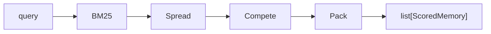

# API Reference

## MemoryEngine

The main entry point for all operations.

```python
from openmem import MemoryEngine

engine = MemoryEngine(
    db_path=":memory:",
    max_hops=2,
    decay_per_hop=0.5,
    weights=None,  # uses defaults
)
```

See [Configuration](configuration.md) for parameter details.

---

### add

```python
engine.add(
    text: str,
    type: str = "fact",
    entities: list[str] | None = None,
    confidence: float = 1.0,
    gist: str | None = None,
) -> Memory
```

Store a new memory.

| Parameter | Type | Default | Description |
|-----------|------|---------|-------------|
| `text` | `str` | required | The memory content |
| `type` | `str` | `"fact"` | One of: `fact`, `decision`, `preference`, `incident`, `plan`, `constraint` |
| `entities` | `list[str]` | `None` | Tagged entities for graph connections |
| `confidence` | `float` | `1.0` | Confidence score (0-1) |
| `gist` | `str` | `None` | Optional short summary (indexed by FTS5) |

**Returns:** A `Memory` object.

```python
m = engine.add(
    "JWT tokens expire after 24 hours",
    type="decision",
    entities=["JWT", "auth"],
    confidence=0.9,
    gist="JWT 24h expiry",
)
print(m.id)  # uuid hex string
```

---

### link

```python
engine.link(
    source_id: str,
    target_id: str,
    rel_type: str = "mentions",
    weight: float = 0.5,
) -> Edge
```

Create a directed edge between two memories. Edges are traversed bidirectionally during spreading activation.

| Parameter | Type | Default | Description |
|-----------|------|---------|-------------|
| `source_id` | `str` | required | Source memory ID |
| `target_id` | `str` | required | Target memory ID |
| `rel_type` | `str` | `"mentions"` | One of: `mentions`, `supports`, `contradicts`, `depends_on`, `same_as` |
| `weight` | `float` | `0.5` | Edge weight (0-1). Higher = stronger activation spread. |

**Returns:** An `Edge` object.

```python
edge = engine.link(m1.id, m2.id, "supports", weight=0.8)
```

---

### recall

```python
engine.recall(
    query: str,
    top_k: int = 5,
    token_budget: int = 2000,
) -> list[ScoredMemory]
```

Retrieve relevant memories for a query.

| Parameter | Type | Default | Description |
|-----------|------|---------|-------------|
| `query` | `str` | required | Natural language query |
| `top_k` | `int` | `5` | Maximum number of results |
| `token_budget` | `int` | `2000` | Max estimated tokens across all results |

**Returns:** A list of `ScoredMemory` objects, sorted by score descending.



```python
results = engine.recall("authentication setup", top_k=5, token_budget=2000)
for r in results:
    print(f"{r.score:.3f} | {r.memory.text}")
    print(f"  components: {r.components}")
```

---

### reinforce

```python
engine.reinforce(memory_id: str) -> None
```

Boost a memory's strength. Call this when a memory proves useful.

- Increases `strength` by `0.1` (clamped to 1.0)
- Increments `access_count`
- Updates `last_accessed` timestamp

```python
engine.reinforce(m.id)
```

---

### supersede

```python
engine.supersede(old_id: str, new_id: str) -> None
```

Mark a memory as outdated, replaced by a newer one.

- Sets old memory's status to `"superseded"` (50% score penalty)
- Creates a `same_as` link from new to old (weight 0.3)

```python
m_old = engine.add("API uses v1 endpoints", type="fact")
m_new = engine.add("API migrated to v2 endpoints", type="fact")
engine.supersede(m_old.id, m_new.id)
```

---

### contradict

```python
engine.contradict(id_a: str, id_b: str) -> None
```

Flag two memories as contradicting each other. During recall, the weaker memory (by strength x confidence x recency) gets demoted to 30% of its score.

- Creates a `contradicts` edge (weight 0.8) between the two memories

```python
engine.contradict(m1.id, m2.id)
```

---

### decay_all

```python
engine.decay_all() -> None
```

Run a decay pass over all memories. Reduces `strength` based on time elapsed:

```
new_strength = strength * exp(-0.01 * days_elapsed)
```

Call this periodically (e.g. daily, or on each session start).

---

### stats

```python
engine.stats() -> dict
```

Returns summary statistics:

| Key | Type | Description |
|-----|------|-------------|
| `memory_count` | `int` | Total memories |
| `edge_count` | `int` | Total edges |
| `avg_strength` | `float` | Average memory strength |
| `active_count` | `int` | Memories with status `"active"` |
| `superseded_count` | `int` | Memories with status `"superseded"` |
| `contradicted_count` | `int` | Memories with status `"contradicted"` |

---

## Data models

### Memory

```python
from openmem import Memory
```

| Field | Type | Description |
|-------|------|-------------|
| `id` | `str` | UUID hex string |
| `type` | `str` | Memory type |
| `text` | `str` | Content |
| `gist` | `str \| None` | Optional summary |
| `entities` | `list[str]` | Tagged entities |
| `created_at` | `float` | Unix timestamp |
| `updated_at` | `float` | Unix timestamp |
| `strength` | `float` | 0-1, decays over time |
| `confidence` | `float` | 0-1, set at creation |
| `access_count` | `int` | Number of times recalled |
| `last_accessed` | `float \| None` | Last recall timestamp |
| `status` | `str` | `active`, `superseded`, or `contradicted` |

### Edge

```python
from openmem import Edge
```

| Field | Type | Description |
|-------|------|-------------|
| `id` | `str` | UUID hex string |
| `source_id` | `str` | Source memory ID |
| `target_id` | `str` | Target memory ID |
| `rel_type` | `str` | Edge type |
| `weight` | `float` | 0-1 |
| `created_at` | `float` | Unix timestamp |

### ScoredMemory

```python
from openmem import ScoredMemory
```

| Field | Type | Description |
|-------|------|-------------|
| `memory` | `Memory` | The memory object |
| `score` | `float` | Final competition score |
| `activation` | `float` | Raw activation value |
| `components` | `dict` | Score breakdown: `{activation, recency, strength, confidence}` |
