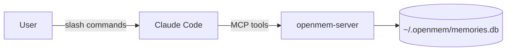

# Claude Code Plugin

OpenMem ships as a Claude Code plugin — persistent memory across coding sessions with zero configuration.



## Installation

### Prerequisites

```bash
pip install openmem-engine "mcp>=1.0"
```

### Install the plugin

```bash
# From a local clone
claude plugin install --path /path/to/openmem/plugin

# Or if you're in the repo root
claude plugin install --path ./plugin
```

Restart Claude Code after installation.

## Slash commands

### `/openmem:recall [query]`

Recall memories relevant to the current conversation. If you provide a query, it searches for that specifically. If you omit the query, Claude infers context from the conversation.

```
/openmem:recall authentication flow
```

Returns matching memories ranked by relevance, showing type, content, score, confidence, and strength.

### `/openmem:store [content]`

Store important information from the current conversation. If you provide content, it stores that directly. If omitted, Claude extracts key facts, decisions, and preferences from the conversation.

```
/openmem:store We decided to use JWT with 24h expiry for auth tokens
```

### `/openmem:status`

Show memory store statistics — total memories, breakdown by status, edge count, and average strength.

```
/openmem:status
```

## MCP tools

The plugin registers an MCP server that exposes 7 tools Claude can call automatically during any conversation:

| Tool | Description |
|------|-------------|
| `memory_store` | Store a new memory with type, entities, confidence, and gist |
| `memory_recall` | Recall memories via BM25 search + spreading activation + competition |
| `memory_link` | Create a relationship between two memories |
| `memory_reinforce` | Boost a memory's strength when it proves useful |
| `memory_supersede` | Mark an old memory as replaced by a newer one |
| `memory_contradict` | Flag two memories as contradicting each other |
| `memory_stats` | Get summary statistics about the memory store |

### `memory_store`

```
text: string        — The content to store
type: string        — fact | decision | preference | incident | plan | constraint
entities: string[]  — Key entities (project names, people, technologies)
confidence: float   — How certain (0.0–1.0, default 1.0)
gist: string        — Optional one-line summary
```

### `memory_recall`

```
query: string        — What you want to remember
top_k: int           — Max results (default 5)
token_budget: int    — Approximate token budget (default 2000)
```

### `memory_link`

```
source_id: string    — Source memory ID
target_id: string    — Target memory ID
rel_type: string     — mentions | supports | contradicts | depends_on | same_as
weight: float        — Edge weight 0.0–1.0 (default 0.5)
```

### `memory_reinforce`

```
memory_id: string    — ID of the memory to boost
```

### `memory_supersede`

```
old_id: string       — ID of the outdated memory
new_id: string       — ID of the replacement memory
```

### `memory_contradict`

```
id_a: string         — First memory ID
id_b: string         — Second memory ID
```

### `memory_stats`

No parameters. Returns counts and average strength.

## Configuration

### Database location

By default, memories are stored in `~/.openmem/memories.db`. Override with the `OPENMEM_DB` environment variable:

```json
{
  "mcpServers": {
    "openmem": {
      "command": "python3",
      "args": ["${CLAUDE_PLUGIN_ROOT}/servers/openmem_server.py"],
      "env": {
        "OPENMEM_DB": "/path/to/custom/memories.db"
      }
    }
  }
}
```

### Startup behavior

The MCP server runs `decay_all()` once on startup, so stale memories naturally lose strength between sessions. No cron jobs needed.

## How it works under the hood

The slash commands are thin prompts that guide Claude to use the MCP tools. The MCP server wraps the `MemoryEngine` class:

1. **Store** — calls `engine.add()` and returns the memory ID
2. **Recall** — runs the full retrieval pipeline (BM25 → spreading activation → competition → conflict resolution → token packing)
3. **Link/Reinforce/Supersede/Contradict** — graph management operations that improve recall quality over time
4. **Stats** — returns aggregate metrics from the store

All data stays local in your SQLite database. Nothing is sent to external services.

## Verification

After installation, verify the plugin is working:

1. Run `/openmem:status` — should show store statistics (0 memories if fresh)
2. Run `/openmem:store This is a test memory` — should confirm storage
3. Run `/openmem:recall test` — should return the memory you just stored
