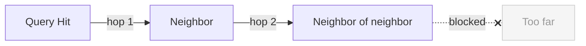

# Configuration

All configuration is passed at engine creation time. There are no config files or environment variables.

## Engine parameters

```python
from openmem import MemoryEngine

engine = MemoryEngine(
    db_path=":memory:",      # Database path
    max_hops=2,              # Spreading activation depth
    decay_per_hop=0.5,       # Activation decay per hop
    weights={                # Scoring weights
        "activation": 0.5,
        "recency": 0.2,
        "strength": 0.2,
        "confidence": 0.1,
    },
)
```

### `db_path`

| Value | Behavior |
|-------|----------|
| `":memory:"` (default) | In-memory database. Fast, but lost on exit. |
| `"memories.db"` | Persistent SQLite file. Survives restarts. |
| Any file path | Creates the file if it doesn't exist. |

### `max_hops`

Controls how far spreading activation traverses the memory graph.



| Value | Effect |
|-------|--------|
| `0` | No spreading — only BM25 direct hits |
| `1` | Activate immediate neighbors |
| `2` (default) | Activate neighbors of neighbors |

Higher values pull in more context but may surface less relevant memories.

### `decay_per_hop`

How much activation drops at each hop. Default is `0.5` (50% reduction per level).

A memory with activation `0.8` at hop 0 activates its neighbor at `0.4` (hop 1), which activates its neighbor at `0.2` (hop 2).

### `weights`

Controls how the final competition score is calculated. Must sum to `1.0`.

| Weight | Default | Description |
|--------|---------|-------------|
| `activation` | `0.5` | Spreading activation score |
| `recency` | `0.2` | How recently the memory was accessed |
| `strength` | `0.2` | Reinforcement history |
| `confidence` | `0.1` | Confidence set at creation time |

## Scoring constants

These are not currently configurable but define the scoring behavior:

| Constant | Value | Description |
|----------|-------|-------------|
| `LAMBDA_RECENCY` | `0.05` | Recency decay rate (~14-day half-life) |
| `ALPHA_DECAY` | `0.01` | Natural strength decay rate |
| `BETA_REINFORCE` | `0.1` | Strength boost on `reinforce()` |
| `CHARS_PER_TOKEN` | `4` | Token estimation for budget packing |

## Status penalties

Memories that have been superseded or contradicted receive score penalties:

| Status | Multiplier |
|--------|-----------|
| `active` | 1.0 (no penalty) |
| `superseded` | 0.5 (50% reduction) |
| `contradicted` | 0.3 (70% reduction) |

## Example configurations

### Recency-heavy (chatbot)

Prioritize recent conversations:

```python
engine = MemoryEngine(
    db_path="chat.db",
    weights={"activation": 0.3, "recency": 0.5, "strength": 0.1, "confidence": 0.1},
)
```

### Deep graph traversal (knowledge base)

Pull in more connected context:

```python
engine = MemoryEngine(
    db_path="knowledge.db",
    max_hops=2,
    decay_per_hop=0.7,  # less decay = more neighbors surface
    weights={"activation": 0.6, "recency": 0.1, "strength": 0.2, "confidence": 0.1},
)
```

### High-confidence only (critical decisions)

Trust confidence scores heavily:

```python
engine = MemoryEngine(
    db_path="decisions.db",
    weights={"activation": 0.4, "recency": 0.1, "strength": 0.2, "confidence": 0.3},
)
```
