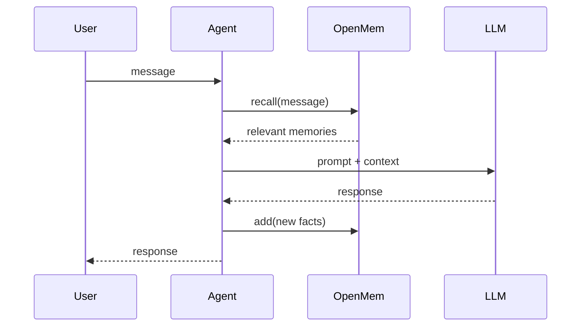
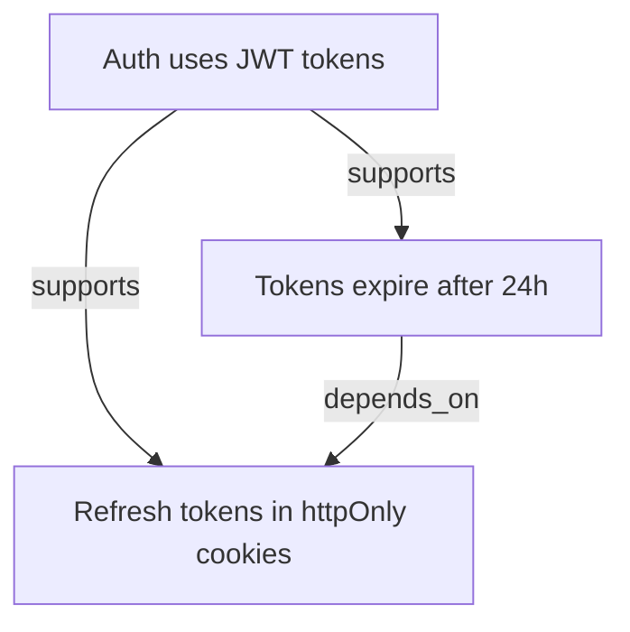

# Agent Integration

Patterns for wiring OpenMem into LLM-based agents.

## Basic pattern



Before each LLM call, recall relevant context and inject it into the prompt:

```python
from openmem import MemoryEngine

engine = MemoryEngine("agent.db")

def agent_turn(user_message: str) -> str:
    # Recall relevant context
    results = engine.recall(user_message, top_k=5, token_budget=2000)
    context = "\n".join(f"- {r.memory.text}" for r in results)

    prompt = f"""Relevant context from previous work:
{context}

User: {user_message}"""

    response = call_llm(prompt)
    return response
```

## Storing memories from conversations

Have your agent extract facts, decisions, and preferences as it works:

```python
# Facts the agent discovers
engine.add(
    "The /api/users endpoint returns 500 on empty payload",
    type="incident",
    entities=["/api/users"],
)

# Decisions made during the session
engine.add(
    "We chose JWT with 24h expiry for auth tokens",
    type="decision",
    entities=["JWT", "auth"],
    confidence=0.9,
)

# User preferences
engine.add(
    "User prefers TypeScript over JavaScript",
    type="preference",
    entities=["TypeScript", "JavaScript"],
)

# Constraints
engine.add(
    "All API responses must include request_id",
    type="constraint",
    entities=["API", "request_id"],
)
```

## Building a knowledge graph

Link related memories as context accumulates:

```python
m1 = engine.add("Auth uses JWT tokens", type="decision", entities=["JWT", "auth"])
m2 = engine.add("Tokens expire after 24h", type="decision", entities=["JWT"])
m3 = engine.add("Refresh tokens stored in httpOnly cookies", type="decision", entities=["JWT", "cookies"])

engine.link(m1.id, m2.id, "supports")
engine.link(m1.id, m3.id, "supports")
engine.link(m2.id, m3.id, "depends_on")
```



A query about "authentication" will pull in all three via spreading activation.

## Reinforcing useful memories

When a memory proves useful, reinforce it:

```python
results = engine.recall("how does auth work?")
for r in results:
    if r.score > 0.5:
        engine.reinforce(r.memory.id)
```

## Handling outdated information

When facts change, supersede instead of deleting:

```python
old = engine.add("API rate limit is 100 req/min", type="fact", entities=["API", "rate-limit"])

# Later, the limit changes
new = engine.add("API rate limit increased to 500 req/min", type="fact", entities=["API", "rate-limit"])
engine.supersede(old.id, new.id)
```

The old memory stays in the graph (for context) but gets a 50% score penalty.

## Session lifecycle

A recommended pattern for long-running agents:

```python
engine = MemoryEngine("project.db")

# Start of session: run decay to age old memories
engine.decay_all()

# During session: add, recall, reinforce, link
# ...

# End of session: check stats
stats = engine.stats()
print(f"Memories: {stats['memory_count']}, Avg strength: {stats['avg_strength']:.2f}")
```

## Multi-agent setup

Multiple agents can share a memory store by pointing to the same database file:

```python
# Agent 1: code assistant
code_engine = MemoryEngine("shared.db")
code_engine.add("Codebase uses ESM modules", type="fact", entities=["ESM"])

# Agent 2: project manager
pm_engine = MemoryEngine("shared.db")
results = pm_engine.recall("module system")
# Finds the memory stored by Agent 1
```

:::warning
SQLite handles concurrent reads well, but concurrent writes from multiple processes may cause locking. For multi-process setups, WAL mode (enabled by default) helps, but handle `SQLITE_BUSY` errors with retries.
:::

## Token budget strategies

Choose a budget based on your model's context window:

```python
# Conservative: small context, precise memories
results = engine.recall(query, top_k=3, token_budget=500)

# Generous: large context, more background
results = engine.recall(query, top_k=10, token_budget=4000)

# Adaptive: scale budget based on available context
available_tokens = model_context_limit - len(user_message) // 4 - system_prompt_tokens
results = engine.recall(query, top_k=10, token_budget=available_tokens)
```
