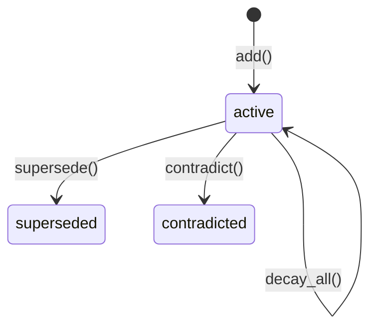

# Quick Start

## Installation

```bash
pip install openmem-engine
```

Or from source:

```bash
git clone https://github.com/dunkinfrunkin/OpenMem.git
cd openmem
pip install -e ".[dev]"
```

:::tip
Using Claude Code? Install the [Claude Code plugin](./claude-code) instead — it gives you slash commands and automatic memory tools with no code required.
:::

## Your first memory engine

```python
from openmem import MemoryEngine

# In-memory (great for testing)
engine = MemoryEngine()

# Or persistent (survives restarts)
engine = MemoryEngine("memories.db")
```

## Storing memories

Every memory has text, a type, and optional entities:

```python
m1 = engine.add(
    "We chose SQLite over Postgres for simplicity",
    type="decision",
    entities=["SQLite", "Postgres"],
)

m2 = engine.add(
    "Postgres has better concurrent write support",
    type="fact",
    entities=["Postgres"],
)

m3 = engine.add(
    "User prefers TypeScript over JavaScript",
    type="preference",
    entities=["TypeScript", "JavaScript"],
)
```

Available memory types: `fact`, `decision`, `preference`, `incident`, `plan`, `constraint`.

## Linking memories

Create edges between related memories to enable spreading activation:

```python
engine.link(m1.id, m2.id, "supports")
```


Available edge types: `mentions`, `supports`, `contradicts`, `depends_on`, `same_as`.

## Recalling memories

```python
results = engine.recall("Why did we pick SQLite?", top_k=5, token_budget=2000)

for r in results:
    print(f"{r.score:.3f} | {r.memory.text}")
# 0.800 | We chose SQLite over Postgres for simplicity
# 0.500 | Postgres has better concurrent write support
```

## Managing memory lifecycle

```python
# Reinforce a memory (boosts strength, updates access time)
engine.reinforce(m1.id)

# Supersede an outdated memory
m_new = engine.add("We switched to Postgres for scale", type="decision", entities=["Postgres"])
engine.supersede(m1.id, m_new.id)  # m1 gets penalized in future recalls

# Flag contradictions
engine.contradict(m1.id, m_new.id)  # weaker one gets demoted automatically

# Run decay pass (call periodically)
engine.decay_all()

# Check stats
print(engine.stats())
```


