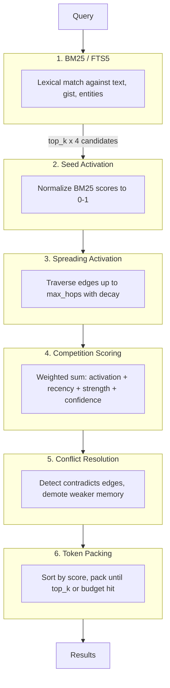
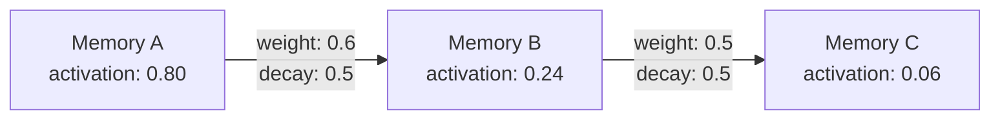
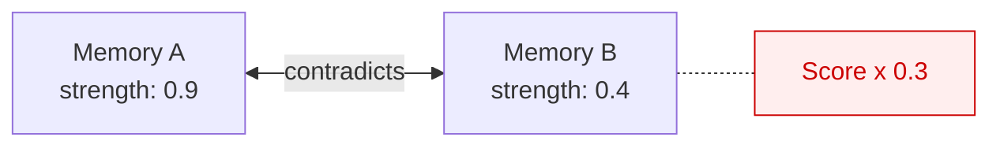

# Retrieval Model

OpenMem's retrieval pipeline is inspired by human memory — memories are activated by cues, spread to related memories, and compete for recall.

## Pipeline overview



## Stage 1: BM25 lexical search

The query is matched against a SQLite FTS5 virtual table that indexes each memory's `text`, `gist`, and `entities` fields. FTS5's built-in BM25 ranking produces relevance scores.

OpenMem fetches `top_k x 4` candidates to give spreading activation enough seeds to work with.

:::note
Queries are escaped for FTS5 safety — special characters won't cause SQL errors.
:::

## Stage 2: Seed activation

Raw BM25 scores are normalized to the range [0, 1] by dividing by the maximum score in the result set. These become the initial activation values.

## Stage 3: Spreading activation

Starting from the seed memories, activation spreads outward through the memory graph:

```
activated_neighbor = source_activation x edge_weight x decay_per_hop
```



- **Bidirectional** — edges are traversed in both directions
- **Max hops** — traversal stops after `max_hops` levels (default: 2)
- **Decay per hop** — each hop reduces activation by `decay_per_hop` (default: 0.5)
- **Max wins** — if a memory receives activation from multiple paths, the highest value is kept

Memory C wasn't a BM25 hit at all, but it surfaces because it's connected to relevant memories.

## Stage 4: Competition scoring

Each activated memory receives a composite score:

```
score = (w_activation x activation
       + w_recency x recency
       + w_strength x strength
       + w_confidence x confidence)
       x status_penalty
```

### Component formulas

**Recency:**

```
recency = exp(-0.05 x days_since_last_access)
```

Half-life of approximately 14 days. Memories accessed yesterday score ~0.95. Memories untouched for a month score ~0.22.

**Strength:**

Strength starts at 1.0 and changes over time:

- `reinforce()` adds 0.1 (clamped to 1.0)
- `decay_all()` applies: `strength x exp(-0.01 x days_elapsed)`

**Confidence:** Set at creation time (0-1). Never changes automatically.

**Status penalty:**

| Status | Multiplier |
|--------|-----------|
| `active` | 1.0 |
| `superseded` | 0.5 |
| `contradicted` | 0.3 |

### Default weights

| Component | Weight |
|-----------|--------|
| `activation` | 0.5 |
| `recency` | 0.2 |
| `strength` | 0.2 |
| `confidence` | 0.1 |

## Stage 5: Conflict resolution

After scoring, OpenMem checks for `contradicts` edges between activated memories:



1. Compare effective strength: `strength x confidence x recency`
2. The weaker memory gets its score multiplied by 0.3

## Stage 6: Token packing

Results are sorted by final score and packed:

1. Estimate each memory's token count: `len(text) / 4`
2. Add memories in score order until `top_k` or `token_budget` is reached
3. Update `access_count` and `last_accessed` for returned memories

## Design philosophy

OpenMem deliberately avoids embeddings and vector search:

- **Deterministic** — identical queries always return identical results
- **Inspectable** — you can trace exactly why a memory was recalled (BM25 hit? graph neighbor? high strength?)
- **Fast** — SQLite FTS5 + BM25 is extremely fast for the typical memory store size
- **No drift** — embedding models change between versions, causing silent retrieval degradation. BM25 doesn't have this problem.

The tradeoff is that OpenMem won't catch purely semantic similarities (e.g., "canine" won't match "dog" unless they share entities or graph edges). For most agent memory use cases, lexical overlap + graph structure covers the important cases.
